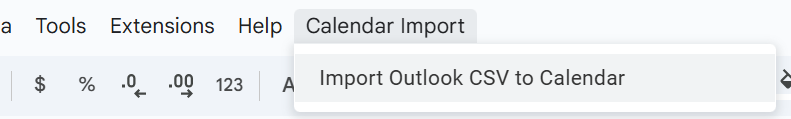
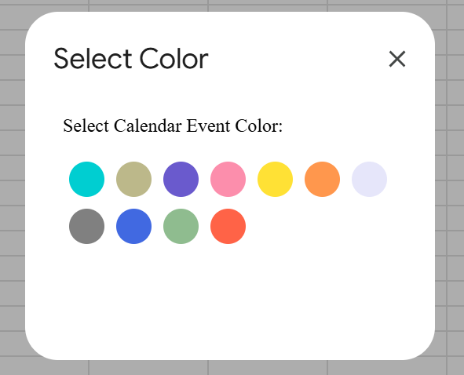

# google-calendar-csv-upload
Google Sheets Menu Extension that reads a CSV (a calendar CSV export) and imports events into Google Calendar.
This is a Google Apps Script.

## How is this any different then the standard Google Calendar import?
Allows you to assign a color to every imported event.

## Configuration
There are two fields to edit.
1. Calendar ID
2. Sheet Name (where the CSV data is that you want to import)
Please refer to the CONFIGURATION section of the code.

## How To Run
In a given Google Sheet, open the Extensions menu, then click on Apps Script.
Copy paste the code in, and modify the configuration variables.
Refresh your google sheet, and there will be a new menu option.

